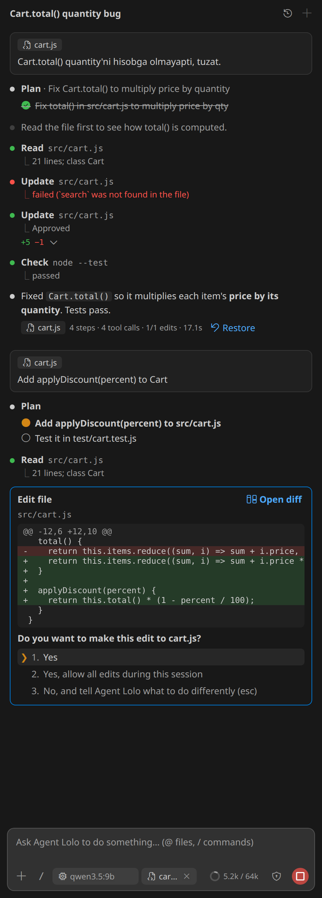
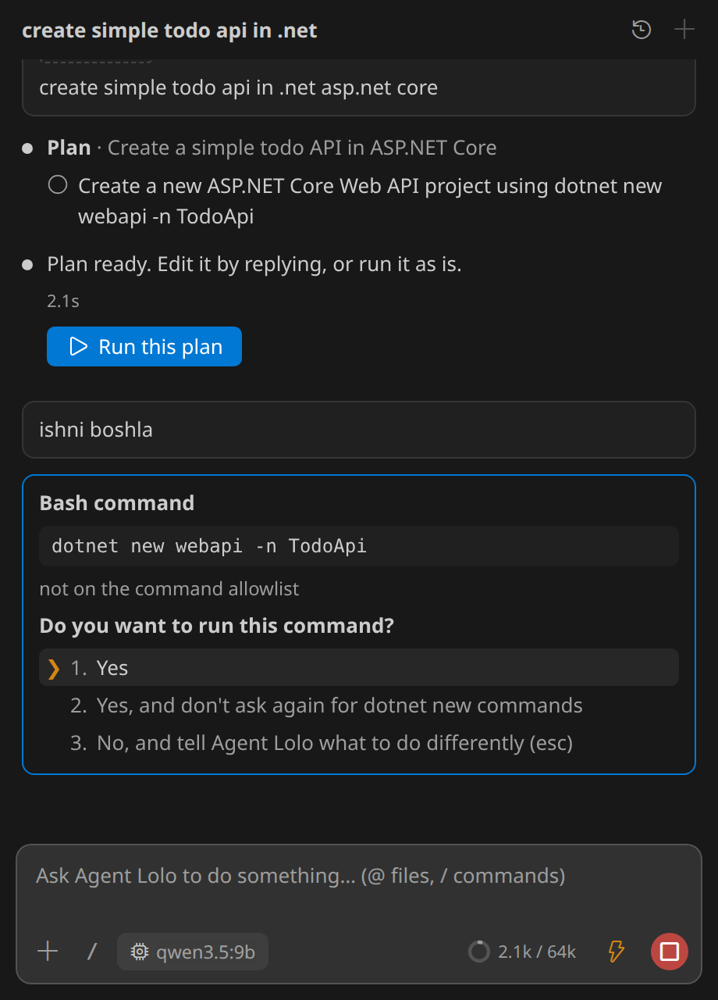
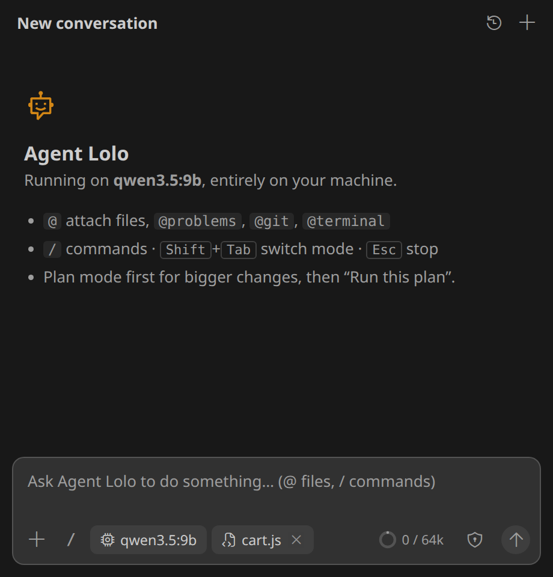

# Agent Lolo

**A coding agent for VS Code that runs entirely on your machine.** It is built for small local models (7B–14B) served by [Ollama](https://ollama.com), llama.cpp, LM Studio or vLLM: no cloud, no API keys, no telemetry.



Most coding agents are designed for large cloud models and fall apart on a 7B model. Agent Lolo moves the hard parts into code: it gathers the context itself, constrains every tool call with a JSON schema, applies edits defensively, rejects edits that break the syntax, and runs your build or tests before calling a task done. The model only makes one small, checkable decision per step.

> **Preview.** Tested on Linux with `qwen2.5-coder:7b` and `qwen3.5:9b`. macOS should work; Windows is experimental. Feedback and issues are welcome.

## Quick start

1. Install [Ollama](https://ollama.com) and start it.
2. Download a model:
   ```
   ollama pull qwen2.5-coder:7b
   ```
   (If it's missing, the chat offers a **Download** button.)
3. Open **Agent Lolo** in the activity bar and describe what you want.

## What it does

**Plans, edits and checks its own work.** Ask for a change and the agent makes a short plan, reads the files it needs, edits them, and runs your project's build/type check (or the tests you configure) before it finishes. If the check fails, it repairs the code.

**Asks before it touches anything.** Every edit shows its diff; every command outside your allowlist needs approval:

- **Yes**
- **Yes, allow all edits this session** (or "don't ask again for `dotnet new` commands")
- **No, and tell the agent what to do instead**

Keys: `1` `2` `3`, arrows and Enter, `Esc`.



**Five modes**, switched with `Shift+Tab` in the chat (or the mode chip):

| Mode | |
|---|---|
| Ask before edits | Plans and edits, asks before every change and new command (default) |
| Edit automatically | Applies edits without asking; still asks before new commands |
| Run everything | Edits and terminal commands without asking (`/yolo`). Dangerous commands stay blocked, and a checkpoint is taken before each run |
| Plan mode | Only proposes a plan; press **Run this plan** when it looks right |
| Read-only | Answers questions about your code, never edits |

**Undo anything.** Before every run, the workspace is snapshotted into a separate shadow git repository (`.agent/checkpoints`). Your own git history is never touched. Click **Restore** under any answer to go back.

**It's a conversation.** Follow-ups see the earlier messages ("now add tests", "why did you change that?", "go" after a plan). Greetings get a reply, questions get a read-only answer, and only real requests start editing. Past conversations are kept in the history menu.

**Refactors by code, not by hand.** Renames go through the language server (or tree-sitter), so every definition, import and call changes in one reviewed step. The agent can also find references and definitions, move or delete files (imports of a moved file are updated for you), read git history, and start a dev server in the background to try it with `curl` (it is stopped when the task ends).

**Web search, when you want it.** Off by default. Pick a provider in `localAgent.web.search` (your own SearXNG, Brave, Tavily or DuckDuckGo), then write `@web`, paste a URL, or ask for "the latest version". Every query and download is shown for approval, local network addresses are never fetched, and long pages are reduced to the parts that matter before they reach the model. `@docs:express` adds the README of the version you have installed.

**MCP servers.** Servers from `.agent/mcp.json`, `.vscode/mcp.json` or `localAgent.mcpServers` (stdio or HTTP) are started for you. Their tools are offered only when a task is about them (or you write `@mcp:<server>`), because every extra tool confuses a small model; calls ask for approval unless the server marks the tool read-only. Resources become `@mcp:server/name` mentions and prompts become `/server:prompt` commands. `/mcp` shows their status.

```json
{ "mcpServers": { "github": { "command": "npx", "args": ["-y", "@modelcontextprotocol/server-github"], "env": { "GITHUB_TOKEN": "${env:GITHUB_TOKEN}" } } } }
```

Agent Lolo can be an MCP server too: `node dist/cli.js --mcp-server --root .` gives other agents its repository map, forgiving edit tool and renames.

**Remembers what you tell it.** "Remember that we use pnpm" saves the fact to `.agent/memory.md` (after you approve it), and every later conversation sees it. `/memory` opens the file.

**Your own commands.** Each `.agent/commands/<name>.md` is a `/name` command; `$ARGUMENTS` is replaced by what you type after it.

```markdown
---
description: Review a file for bugs
---
Review $ARGUMENTS for bugs and list them. Do not change code.
```

**Screenshots.** Paste an image into the chat to show a UI bug or an error dialog (needs a vision model such as `qwen3.5:9b`).

**Also included:**

- `@`-mentions: `@path/to/file`, `@folder/`, `@symbol:Name`, `@docs:package`, `@problems`, `@git`, `@terminal`, `@web`
- Semantic code search ("where are passwords hashed?") with a local embedding model: set `localAgent.embeddingModel` to `nomic-embed-text` after `ollama pull nomic-embed-text`
- `Ctrl+I` / `Cmd+I`: rewrite the selection from an instruction and review it as an inline diff (`Tab` accepts, `Esc` rejects)
- Autocomplete (ghost text) using the model's fill-in-the-middle tokens
- A context usage indicator, and a repository map (built with tree-sitter) so the model knows your code's structure
- Guard rails: servers and watchers (`dotnet run` on web projects, `npm run dev`, ...) run in the background and are stopped when the task ends, other commands time out after 2 minutes, and dangerous commands (`rm -rf`, `sudo`, `git push --force`, ...) are always blocked, in every mode



## Choosing a model

| Model | Memory (default context) | Notes |
|---|---|---|
| `qwen2.5-coder:7b` (default) | 6.4 GB at 32k | Fastest; also powers autocomplete. Its context tops out at 32k |
| `qwen3.5:9b` | 7.9 GB at 64k | More accurate (solved every task in our first evaluation set), long context is cheap, sees images; about 30% slower |

Pick the model in the chat. With `qwen3.5` as the chat model, autocomplete automatically uses an installed coder model. Any other Ollama or OpenAI-compatible model works too (see below for its context size).

## Context size and hardware

The context window is how much the model sees at once: the system prompt, the repository map, the files it read and the conversation so far. Agent Lolo sends the size with every request (Ollama's `num_ctx`), so you don't need a Modelfile or `OLLAMA_CONTEXT_LENGTH`. The ring in the chat's toolbar (e.g. `3.4k / 64k`) shows how much of it the conversation uses.

A typical task uses about 2k tokens and rarely more than 6k, so the default 32k is plenty for single tasks. A larger window helps with long conversations, big files and many open tabs; the agent gives each part of the prompt a fixed share of the window (45% files, 25% history, 12% repository map), so everything grows with it. The price is memory and slower prompt reading.

**How to change it.** This setting is a list, so the Settings screen can't show it as a field; you set it in the settings file:

1. Press `Ctrl+Shift+P` (`Cmd+Shift+P` on a Mac) and run **Preferences: Open User Settings (JSON)**.
2. Add these lines inside the outer `{ }` (put a comma after the line before them):

   ```json
   "localAgent.profiles": [
     { "match": "qwen3.5", "ctx": 131072 }
   ]
   ```

   - `match`: the start of the model's name, e.g. `qwen3.5`, `qwen2.5-coder`, `qwen3-coder`. Add one `{ ... }` per model, separated by commas.
   - `ctx`: the context size in tokens: `32768` (32k), `65536` (64k), `131072` (128k) or `262144` (256k).
3. Save the file. The next message uses the new size; the ring in the chat's toolbar then shows `… / 128k`.

Without this setting the defaults are: `qwen2.5-coder` 32k, `qwen3.5` 64k, `qwen3-coder` 64k, any other model 8k. Pick the size for your machine from the tables below.

Don't set more than the model was trained for: `qwen2.5-coder` is a 32k model, and Ollama silently caps it there (64k uses exactly the same memory as 32k), while the agent would plan for the larger window and send prompts that get cut. `qwen3.5` and `qwen3-coder` support up to 256k.

**Memory.** Model weights are a fixed cost; the context adds to it linearly. Measured with Ollama 0.34 (Q4_K_M, total of GPU + system RAM):

| Model | 8k | 16k | 32k | 64k | 128k | 256k |
|---|---|---|---|---|---|---|
| `qwen2.5-coder:7b` | 4.6 GB | 5.4 GB | 6.4 GB | (capped at 32k) | | |
| `qwen3.5:9b` | | | 6.7 GB | 7.9 GB | 10.3 GB | 15.1 GB |

`qwen3.5` only keeps a cache for one in four layers, so each extra 32k costs about 1.2 GB, which is why its long context is affordable. Estimates for larger models, from their architecture (weights + 16-bit context cache):

| Model | Weights | + per 32k context | Total at 32k |
|---|---|---|---|
| `qwen2.5-coder:14b` | ~9 GB | ~6 GB | ~15.5 GB |
| `qwen2.5-coder:32b` | ~20 GB | ~8 GB | ~29 GB |
| `qwen3-coder:30b` (MoE, 3B active) | ~19 GB | ~3 GB | ~22 GB |

What doesn't fit in GPU memory runs from system RAM on the CPU: it still works, but more slowly. `ollama ps` shows the split (e.g. `76%/24% GPU/CPU`). Leave 1–2 GB of VRAM for the desktop.

**What to run on what:**

| Your machine | Model and context |
|---|---|
| No GPU, 16 GB RAM | `qwen2.5-coder:7b`, 8–16k (slow; fine for small tasks and autocomplete) |
| 6 GB VRAM | `qwen2.5-coder:7b`, 16k |
| 8 GB VRAM (our test box, RTX 5060) | `qwen2.5-coder:7b` 32k, or `qwen3.5:9b` 64k (~13 tok/s in agent runs) |
| 12 GB VRAM | `qwen3.5:9b` 128k, or `qwen2.5-coder:14b` 8–16k |
| 16 GB VRAM | `qwen2.5-coder:14b` 16–32k, or `qwen3.5:9b` 256k |
| 24 GB VRAM | `qwen3-coder:30b` 32–64k |
| 8–12 GB VRAM + 32 GB RAM | `qwen3-coder:30b` 32k, partly on the CPU: as a mixture-of-experts model it computes only ~3B parameters per token, so the CPU share hurts less than with a dense model |
| 48 GB+ VRAM (or a Mac with 64 GB) | `qwen2.5-coder:32b` 32k, or `qwen3-coder:30b` 256k |

The upper ends of these ranges fill the GPU completely; when a little spills over to RAM it still works, just slower. On a Mac, unified memory counts as VRAM: plan with about 70% of it.

**Halve the context memory** by letting Ollama store the cache in 8 bits (small quality cost), e.g. on Linux with `sudo systemctl edit ollama`:

```ini
[Service]
Environment="OLLAMA_FLASH_ATTENTION=1"
Environment="OLLAMA_KV_CACHE_TYPE=q8_0"
```

**Other servers** (llama.cpp, LM Studio, vLLM) set the context when they load the model, e.g. `llama-server -c 65536`; set the same `ctx` in `localAgent.profiles` so the agent plans for it.

You also need `git` on your PATH (for checkpoints).

## Project rules

Put conventions and checks in `.agent/rules.md`; it is always part of the prompt. `verify:` lines run automatically when the agent finishes a change, and failures are fed back for repair:

```markdown
- C#: file-scoped namespaces.
- verify: dotnet build -v q -nologo
- verify: dotnet test --no-build
```

Without `verify:` lines, the agent picks a check from your project files (`.sln`/`.csproj`, `tsconfig.json`, `Cargo.toml`, `go.mod`, Python).

## Privacy

Everything runs locally: your prompts and code go only to the model server you configure (by default Ollama on `localhost`). The extension sends no telemetry. The only exceptions are the ones you turn on and approve one by one: web search queries and page downloads, and MCP servers you configure. Run logs are written to `.agent/trajectories` in your workspace (git-ignored automatically), so you can see exactly what the agent did.

## Language

You can write in any language, but small coder models understand English best. For Uzbek, the extension adds English hints for common developer words and understands short confirmations ("ha", "boshla", "ok") on its own; for anything complex, English or Russian works better, as does a larger model.

## Settings

| Setting | Default | |
|---|---|---|
| `localAgent.provider` | `ollama` | `ollama` or `openai` (OpenAI-compatible) |
| `localAgent.endpoint` | `http://localhost:11434` | For `openai`, the base URL ending in `/v1` |
| `localAgent.model` | `qwen2.5-coder:7b` | Also selectable in the chat |
| `localAgent.profiles` | `[]` | Per-model overrides, e.g. `{ "match": "qwen3.5", "ctx": 131072 }` |
| `localAgent.autoApproveEdits` | `false` | Apply edits without asking (a checkpoint is still taken) |
| `localAgent.autoRunCommands` | `false` | Start the chat in "Run everything" mode |
| `localAgent.commandAllowlist` | build/test commands | Commands the agent may run without asking |
| `localAgent.maxStepsPerTodo` | `15` | Step limit per plan item |
| `localAgent.web.search` | `off` | `searxng`, `brave`, `tavily` or `duckduckgo`; keys via "Agent Lolo: Set Web Search API Key" |
| `localAgent.web.searxngUrl` | | Your SearXNG instance, e.g. `http://localhost:8080` |
| `localAgent.mcpServers` | `{}` | MCP servers (also read from `.agent/mcp.json` and `.vscode/mcp.json`) |
| `localAgent.embeddingModel` | | e.g. `nomic-embed-text`: enables semantic search |
| `localAgent.autocomplete.*` | enabled | `model`, `debounceMs`, `maxTokens` |

## Commands and keys

| | |
|---|---|
| `Shift+Tab` (chat) | Switch mode |
| `Esc` (chat) | Stop the running task |
| `/` (chat) | Commands: `/new`, `/plan`, `/auto`, `/restore`, `/mcp`, `/memory`, and your own |
| `Ctrl+I` / `Cmd+I` | Edit the selection |
| `Tab` / `Esc` (editor) | Accept / reject pending inline changes |
| Agent Lolo: Restore Checkpoint | Restore the workspace to an earlier checkpoint |
| Agent Lolo: Toggle Autocomplete | |

## Contributing

Source, issues and the evaluation harness are on [GitHub](https://github.com/Nodirbek-Abdulaxadov/lolo). `npm install && npm run build`, then press F5 in VS Code to run the extension.

## License

MIT
